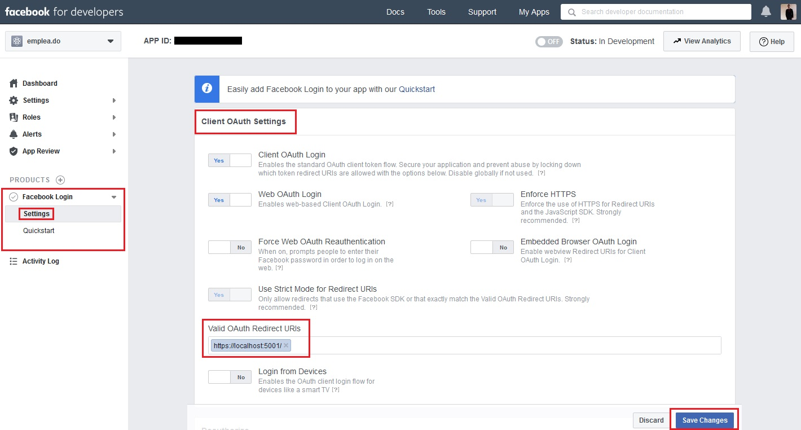

# Authentication

ASP.NET Core Identity is a membership system that adds login functionality to ASP.NET Core apps. In this project we are going to use the following external login providers:

- Facebook
- Microsoft
- LinkedIn
- GitHub
- Google

## Instuctions

Below you will find the instructions, step by step to configure each external login provider in your development environment.

### Facebook

0. Log In in [Facebook](https://www.facebook.com/) using your account
1. Go to [All Apps - Facebook for Developers](https://developers.facebook.com/apps/)
2. In the upper right corner, select _My Apps_ and then click on _Create App_
3. Fill the fields _Display Name_ and _Contact Email_ then click _Create App ID_
4. You will see in the _Dashboard_ a list of _Products_ that you can add, we're going to configure _Facebook Login_, so, click in the _Set Up_ button for that product

5. In the menu on the left, under _Facebook Login_, click on _Settings_. Under the _Client OAuth Settings_, there is a field called Valid _OAuth Redirect URIs_, where you have to put the url of the project, eg. https://localhost:5001/, and then click on the _Save Changes_ button.

6. In the menu on the left, under _Settings_, click on _Basic_, you will see the Facebook _App ID_ and _App Secret_, necessary to configure the Authentication in the project, copy them, you will need it in next step.

7. In the _Web_ project go to the file _appsettings.Development.json_ go to the _Facebook_ obect and paste the _App ID_ and _App Secret_ copied in the previous step.  

8. Run the project and the the Log In using Facebook.
    - Log In using _Facebook_  

    - Successful Log In

### Microsoft
### LinkedIn
### GitHub
### Google

## References

- [Facebook, Google, and external provider authentication in ASP.NET Core](https://docs.microsoft.com/en-us/aspnet/core/security/authentication/social/index?view=aspnetcore-2.2&tabs=visual-studio)

- [External OAuth authentication providers](https://docs.microsoft.com/en-us/aspnet/core/security/authentication/social/other-logins?view=aspnetcore-2.2)

- [Facebook external login setup in ASP.NET Core](https://docs.microsoft.com/en-us/aspnet/core/security/authentication/social/facebook-logins?view=aspnetcore-2.2)

- [Microsoft Account external login setup with ASP.NET Core](https://docs.microsoft.com/en-us/aspnet/core/security/authentication/social/microsoft-logins?view=aspnetcore-2.2)

- [Authenticating with OAuth 2.0 Overview (LinkedIn)](https://docs.microsoft.com/en-us/linkedin/shared/authentication/authentication?context=linkedin/consumer/context)

- [Authorizing OAuth Apps (GitHub)](https://developer.github.com/apps/building-oauth-apps/authorizing-oauth-apps/)

- [Google external login setup in ASP.NET Core](https://docs.microsoft.com/en-us/aspnet/core/security/authentication/social/google-logins?view=aspnetcore-2.2)